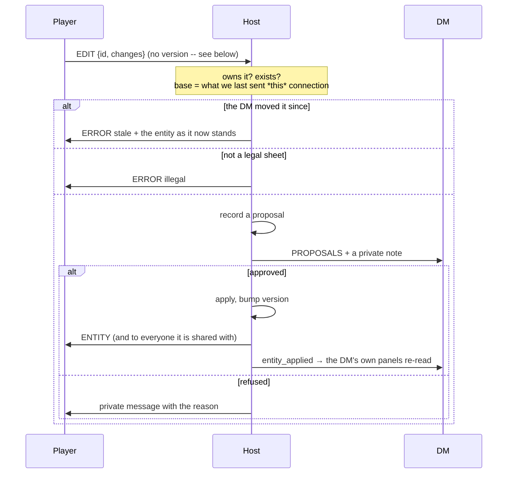
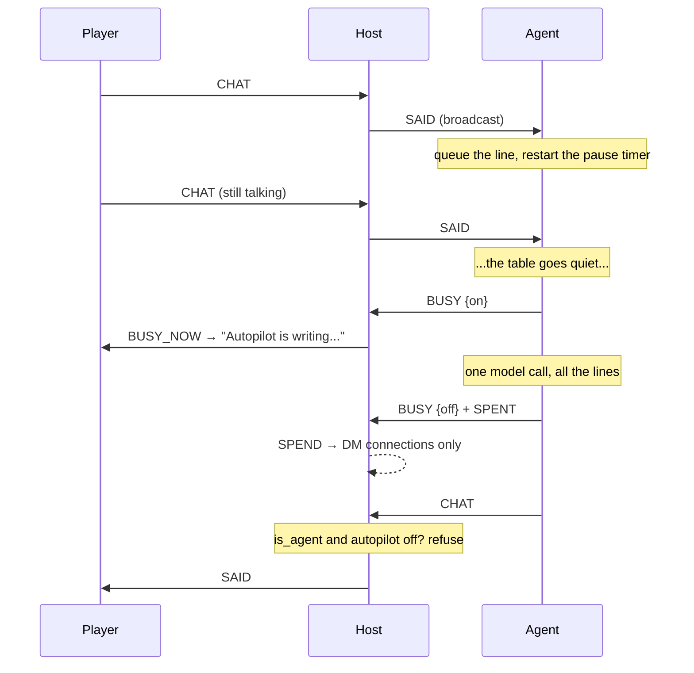

# Architecture

How Canon Keeper is put together, and why. [README.md](README.md) is for people
running a game; this is for people changing the code.

It is written to be **falsifiable**: the structural claims below — which packages
exist, which way they depend, what the version constants are, what migrations
there are — are checked by `tests/test_architecture_doc.py`. If you change the
shape and not this file, the suite fails. Prose about *why* is not checked, and
is the part most worth keeping honest by hand.

---

## The one rule

**What the DM actually says is the only source of truth.**

Everything else is derived, proposed, or projected from it. Two consequences run
through the whole codebase:

- A **proposal can never become a fact**. Facts point at something a human
  entered or said; proposals wait for a human to accept them.
- The **host decides**. A client — a player's app, an agent, an MCP session —
  can ask. It cannot write.

Most of the design below is a consequence of taking those two seriously.

---

## The shape

Five packages. The arrows only point one way, and nothing outside the app
imports the app.

```
              canon_keeper_protocol          stdlib only
                 ▲                ▲
                 │                │
    canon_keeper_client        canon_keeper           PySide6
       ▲            ▲             (the app, the host)
       │            │
  dm_agent        mcp
  (anthropic)     (mcp)
```

| Package | Is | Depends on |
|---|---|---|
| `canon_keeper_protocol` | the wire contract: frames, login, dice | the standard library, nothing else |
| `canon_keeper_client` | a headless connection to a session | `websockets` |
| `canon_keeper` | the app, the host, the source of truth | PySide6, platformdirs, keyring |
| `canon_keeper_dm_agent` | the autopilot agent | `anthropic` |
| `canon_keeper_mcp` | one seat exposed over MCP | `mcp` |

**Why this split.** PySide6 is ~660 MB. An agent that only holds a socket should
not need it, and a client that *can* import `canon_keeper` can open a campaign
database directly — which is exactly the authority these packages are built not
to have. Keeping the arrow pointing one way makes "a client cannot reach your
campaign" a property of the import graph rather than a habit.

They ship in one wheel today. Splitting them into separate distributions is a
packaging change, not an architectural one, and is worth doing when something
outside this repository needs to install one on its own.

---

## Invariants

These are the things to preserve. Almost every bug this project has had was one
of them quietly weakening.

**The host is authoritative.** `SessionServer` validates everything a client
sends. Dice are rolled on the host; a result a client reports is ignored. Sheet
legality is checked on the host, because the client that sent it is the one
thing that cannot be taken at its word.

**Projection is an allowlist, never a denylist.** `net/projection.py` names the
fields a viewer may see. A new field on an entity is therefore private by
default — the failure mode of forgetting to update it is a player not seeing
something, not a player seeing a secret.

**Not sent, rather than hidden.** An entity a player has no share for never
reaches their machine. Its existence is itself a spoiler.

**Versions come from the host.** A client sends no version at all. The base for
an edit is the version the host last *sent that connection* (`_Session.sent`),
so a client cannot choose a convenient one or omit it for an unconditional
write.

**Facts are never deleted.** Contradicting one sets `superseded_by`. Current
state is `WHERE superseded_by IS NULL`, so you can change your mind in session
twenty without corrupting session three.

**Derive, don't store.** Armour class, saving throws, spell slots and the rest
are computed from the sheet on every read (`rules/derive.py`), with an
`overrides` escape hatch. Stored derived values go stale silently.

**An id is only unique inside its file.** Every campaign is its own SQLite file,
so almost every campaign in existence is `campaign.id = 1`. Anything that tells
two campaigns apart from outside — the reconnect cache, the credential store —
must use `campaigns.campaign_key()`, a random per-campaign id. This has caused
two real bugs; expect it to cause a third.

---

## Data

One SQLite file per campaign, in `campaigns/` under the per-OS data directory.
Your own settings, theme and dock layout live separately in `profile.sqlite3`,
so they follow you rather than the campaign — which also gives a player, whose
campaign lives on someone else's machine, somewhere to keep them.

Migrations are numbered `.sql` files driven by `PRAGMA user_version`:

| | |
|---|---|
| `001_init.sql` | campaign, entity, link, session, utterance, fact, proposal, conversation, message, app_layout, setting |
| `002_accounts_and_sharing.sql` | account, share |
| `003_ownership_and_versions.sql` | `entity.owner_account_id`, `entity.version` |
| `004_pending_changes.sql` | the proposal queue |
| `005_chat_log.sql` | chat kept between sessions |
| `006_agent_accounts.sql` | the `agent` role |

`entity.data_json` is how "start small, then evolve" is paid for: new fields
cost a form change, not a migration. The price is that nothing validates them,
so anything load-bearing belongs in a column.

---

## The wire

Newline-free JSON text frames over WebSocket. `PROTOCOL_VERSION = 2`; a
mismatch is refused at the door with a readable reason rather than
half-working.

**Frame caps are direction-dependent.** `MAX_FRAME_BYTES` (16 KB) for what a
host accepts from a client, `MAX_HOST_FRAME_BYTES` (8 MB) for what a client
accepts from the host it authenticated to. One limit for both either lets a
client flood the host or stops a legitimate campaign snapshot arriving — the
second of which was a real bug at about fifteen entities.

**Login is SCRAM-shaped.** The host sends salt and a nonce; the client proves it
knows the password without sending it. A LAN has no TLS and people reuse
passwords. Every failure — no such user, wrong password, disabled account —
returns one identical message, so the login cannot enumerate who plays.

**Reconnect is cheap.** A client caches what it holds and sends its versions on
connect; the host replies with only what changed. The cache is keyed by campaign
*and* by `campaign_key`, and versions from a different campaign are ignored
rather than trusted.

**Roles.** `dm`, `player`, `agent`. An agent gets a DM's *view* — it answers from
the canon — and none of a DM's *authority*: the host refuses its chat whenever
autopilot is off. It is a separate role rather than a DM with an exception,
because an exception is one forgotten `and not is_agent` away from failing open.

---

## The shell and plugins

Every panel, first-party ones included, loads through the
`canonkeeper.panels` entry point group and satisfies `plugin.PanelPlugin`
(`API_VERSION = 1`). Dogfooding the contract is the only thing that keeps it
usable by outsiders.

`AppContext` is the whole public surface: `repos`, `bus`, `log`, `campaign_id`,
`role`, `shared`, `names`, `pending_join`. Panels never import each other — they
coordinate through `bus` signals, so a panel that is not installed simply does
not exist rather than breaking its neighbours.

**Every dock sets `objectName` to the plugin id.** Qt silently drops docks
without one, and the symptom is "my layout randomly resets".

A panel that fails to import, declares the wrong API version, or raises while
building its widget is disabled and reported under **Help ▸ Installed Panels**.
One bad third-party panel must never stop the app opening.

---

## The agent

The DM is a human and the app is for that human. **Autopilot** is a switch they
hold.

The agent is a **client, not a component**: a separate process holding a socket
and a login, started by the app for convenience but reaching nothing the app
does not send it. Convenience changed who types the command, not what the agent
can reach.

- `canon_keeper_client/session.py` — the connection. A second, non-Qt
  implementation of the handshake, which is what turned the wire format from an
  assumption both ends shared into something a stranger has had to read.
- `canon_keeper_dm_agent/responder.py` — **when** to answer. A turn is a lull,
  not a message: lines are gathered and answered once the table pauses, only one
  answer is ever in flight, and the human wins any race.
- `canon_keeper_dm_agent/context.py` — **what it is told**. Canon first and
  labelled binding, prose second; a model given atmosphere and facts together
  will average them, and averaging invents.
- `canon_keeper_dm_agent/brain.py` — the model call, deliberately thin.

`canon_keeper_mcp` is the same idea with a different mouth: one login exposed as
MCP tools. `roll` is rolled on the host; `update_my_character` returns "sent to
your DM", because that is what happened.

---

## The main flows

The five paths worth knowing before changing anything. Each one is the same
argument in a different costume: **a client asks, the host decides, and what
comes back is filtered for whoever asked.**

### Starting up

A campaign comes first, because a Characters panel with no campaign behind it
is a list of nobody.

`__main__` → `CampaignDialog` (or straight in, if this campaign is set to open
automatically) → `Launch` → `app.build_context` → the plugin loader discovers
panels for that `role` → `MainWindow` docks them and restores the saved layout.

A remote launch produces `role = "player"` and a `pending_join`, so the Table
panel connects without asking for the same password twice.

### Joining a session

The whole handshake, including the part that is deliberately unhelpful.

```mermaid
sequenceDiagram
    participant C as Client
    participant H as Host
    C->>H: HELLO {username, known versions, campaign_key}
    H->>C: CHALLENGE {salt, nonce}
    Note over C: verifier = scrypt(password, salt)<br/>the password never leaves
    C->>H: LOGIN {proof = HMAC(verifier, nonce)}
    Note over H: verify; every failure returns<br/>one identical message
    H->>C: WELCOME {you, campaign, campaign_key, members}
    H->>C: HISTORY {last 100 messages}
    H->>C: SNAPSHOT {what this account may see}
    H->>C: PANEL_NAMES
    H-->>C: PROPOSALS + FACTS (DM viewers only)
    H->>C: AUTOPILOT {on, by}
    H->>C: ROSTER, and "X joined" to everyone else
```

The decoy salt matters: an unknown username still gets a plausible challenge,
derived deterministically from the name, so timing and shape cannot be used to
discover who plays in the campaign.

### A player changes their character

Nothing is applied. Everything is a request, hit points included.



**The client sends no version.** The base is `_Session.sent[entity_id]` — what
the host last sent *that connection*. A client that chose its own version could
pick a convenient one, or omit it and get an unconditional write.

### The DM changes something

The mirror image, and much shorter, because the DM's app *is* the host.

`panel writes via repos` → `bus.entity_changed` → the Table panel calls
`refuse_conflicting(id)` then `publish_entity(id)` → for each connection:
visible to them? → `project_entity` for that viewer → `ENTITY`, or
`ENTITY_GONE` if it has been deleted or unshared.

`refuse_conflicting` is skipped when the change came from a player's approved
request — otherwise approving a level-up would cancel the damage they took a
moment earlier.

### Autopilot answering



Three gates, and each exists because the alternative is worse at a table: the
agent waits for a lull rather than answering every line; only one answer is
ever in flight; and the host refuses its chat outright whenever autopilot is
off, so "off" is not a promise the agent keeps.

### Reconnecting

Cheap on purpose, because a session that drops mid-fight should come back
without re-sending the campaign.

`cache.load(url, user)` → entities **and** the `campaign_key` they came from →
`HELLO {known, campaign}` → the host's `_trusted_versions` **discards the whole
lot if the key does not match**, because a cache from another campaign has the
same ids and the same versions → `snapshot_since` → `SNAPSHOT {changed, gone,
partial: true}`.

That key check is not defensive programming. Without it a player was served a
different campaign's character, which is how it came to exist.

---

## Decisions, and what they cost

| Decision | Why | What it costs |
|---|---|---|
| PySide6 over Electron/Tauri | docking *is* the requirement, and `QDockWidget` is Qt's core competency; one language end to end | 660 MB, and the packaging split above |
| Own protocol over Matrix/XMPP/MQTT | every chat platform still leaves you writing the real protocol, which is state sync and not chat | a protocol to version and defend |
| Whole-entity versions over per-field deltas | measured: deltas save ~240 KB a session — nothing — for a diff/patch layer whose bugs produce silently wrong state | slightly larger frames |
| Tailscale Funnel over hole punching | solves NAT, TLS and a stable address in one command, and players install nothing | the host installs Tailscale |
| Local Whisper over a hosted API | no audio leaves the machine and there is nothing to pay for | a few hundred MB of model |
| Derive, don't store | stored derived values go stale silently | recomputation on every read |

---

## Where to look

```
canon_keeper/
  plugin.py         the public contract: PanelPlugin, AppContext, API_VERSION
  bus.py            Qt signals panels coordinate through
  campaigns.py      campaign files, and campaign_key()
  credentials.py    OS credential store, degrades rather than fails
  agent_runner.py   creating the agent login and supervising its process
  shell/            main window, docking, layouts, plugin loader, startup
  db/               connection, migrate, migrations/
  repo/             one module per table
  net/              server, client, projection, cache, discovery, funnel, state
  rules/            sheet schema, derivation, validation
  content/          SRD 5.1 + homebrew merge
  audio/            capture, transcription, dictation
  panels/           characters, cities, transcript, table
  templates/        one-shots: the format, the builder, and the bundled JSON
```

---

## One-shots

A **template** is a JSON description of a starting point. Starting one builds an
ordinary campaign from it — entities, facts, logins, shares and a storyline —
and the only trace is a settings key naming the template it came from.

That key is the whole mechanism. Its presence is what makes **Start Again**
offerable; clearing it is what turns a one-shot into a campaign you keep.
Nothing about the content is special, which is why "keep it" costs one write.

The property that matters is **determinism**: the same template started twice
produces the same campaign. Nothing in the builder generates anything — no
random passwords, no timestamps in content, no assumed ids. Entities are created
in file order and referred to by the template's own keys, so a share can point
at "the innkeeper" without knowing which row that became. A test asserts two
runs are identical; it is how the unstable ordering in `facts.current()` was
found.

Templates serve two purposes that want the same thing: an evening that begins
somewhere specific, and a test fixture with four logins that already exist.

---

## Known gaps

Written down so they are choices rather than surprises.

- **The agent's output quality is unmeasured.** Every layer around it is tested;
  whether it writes a good scene is not, and cannot be by a unit test.
- **No guided level-up.** Levels can be set; nothing prompts for the HP roll or
  the ASI.
- **The homebrew merge layer has no editing UI.** `Content` merges it; nothing
  writes to it.
- **MCP sends campaign context to whatever model the client runs.** Fine for a
  player's own seat; pointing it at a DM login sends your secrets to whoever
  runs that model.
- **Sub-packages version in lockstep** with the app because they ship in one
  wheel. Publishing them separately means deciding whether that stays true.
