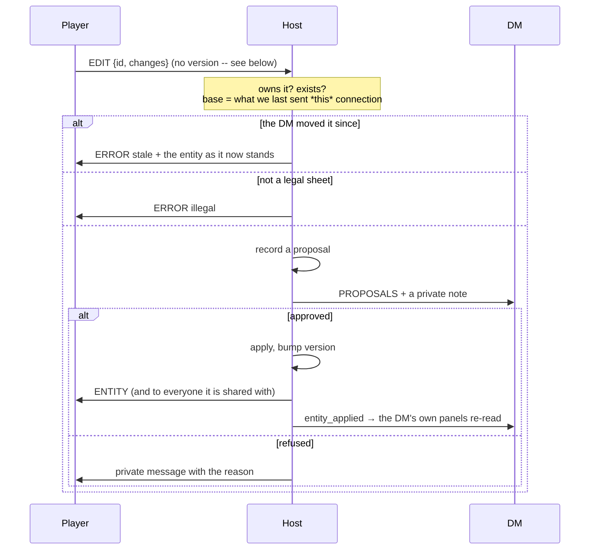
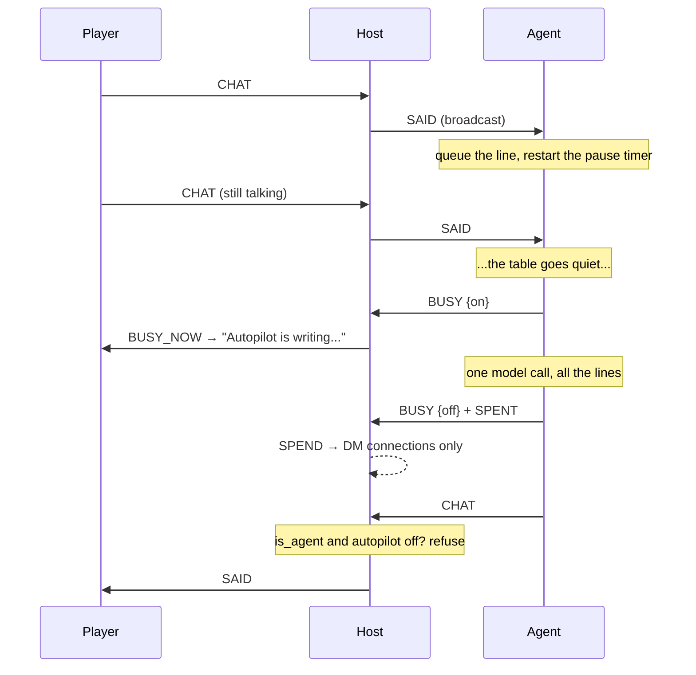
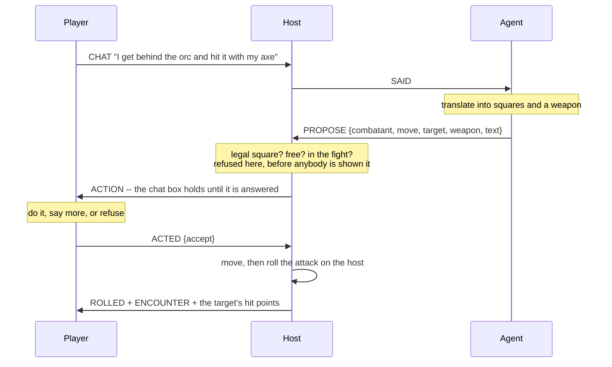

# Architecture

How Canon Keeper is put together, and why. [README.md](README.md) is for people
running a game; this is for people changing the code.

It is written to be **falsifiable**: the structural claims below — which packages
exist, which way they depend, what the version constants are, what migrations
there are — are checked by `tests/test_architecture_doc.py`. If you change the
shape and not this file, the suite fails. Prose about *why* is not checked, and
is the part most worth keeping honest by hand.

---

## The one rule

**What the DM actually says is the only source of truth.**

Everything else is derived, proposed, or projected from it. Two consequences run
through the whole codebase:

- A **proposal can never become a fact**. Facts point at something a human
  entered or said; proposals wait for a human to accept them.
- The **host decides**. A client — a player's app, an agent, an MCP session —
  can ask. It cannot write.

Most of the design below is a consequence of taking those two seriously.

---

## The shape

Six packages. The arrows only point one way, and nothing outside the app
imports the app.

```
              canon_keeper_protocol          stdlib only
                 ▲                ▲
                 │                │
    canon_keeper_client        canon_keeper           PySide6
     ▲       ▲       ▲           (the app, the host)
     │       │       │
 dm_agent  player   mcp
(anthropic) agent   (mcp)
```

| Package | Is | Depends on |
|---|---|---|
| `canon_keeper_protocol` | the wire contract: frames, login, dice | the standard library, nothing else |
| `canon_keeper_client` | a headless connection to a session | `websockets` |
| `canon_keeper` | the app, the host, the source of truth | PySide6, platformdirs, keyring |
| `canon_keeper_dm_agent` | the autopilot agent, answering for the DM | `anthropic` |
| `canon_keeper_player_agent` | one character, played while its player is away | the standard library |
| `canon_keeper_mcp` | one seat exposed over MCP | `mcp` |

**The player agent is one per character, and that is the design.** It connects
on a seat token, so it is sent what that player is sent and nothing else — two
characters handed over are two processes with two views, and neither knows what
the other was told. Before it existed, a handed-over character was played by the
*DM's* agent, which sees every secret: it knew where the ambush was and walked
around it, which looks like good play and is cheating.

It also does not move anybody. It says what the character does in plain words,
autopilot turns that into rules and proposes it, and the stand-in answers yes —
the same three steps a person's turn takes. A second path that let a machine
move a token directly would be the one nobody looks at again, and the one where
a rule quietly stops being enforced. It has no model of its own yet: the
decision is worked out from the map, so it costs nothing to run.

`stand_ins.StandIns` starts and stops them, on the machine hosting the session,
by comparing the handed-over characters against the running processes whenever
the fight changes. The seat token goes through the **environment**, never the
command line, which is readable by anyone who can list processes — the DM
agent's password is passed the same way and for the same reason.

**Handed over is a wish; a stand-in connected is whether it came true.** The
projection carries both, because autopilot needs the difference: it proposes a
turn to a seat that can answer and takes it outright when nobody can. Getting
that wrong is not cosmetic — a proposal nobody can accept stops the fight, which
is exactly what happened when the instruction to propose shipped before the
thing that answers.

**Why this split.** PySide6 is ~660 MB. An agent that only holds a socket should
not need it, and a client that *can* import `canon_keeper` can open a campaign
database directly — which is exactly the authority these packages are built not
to have. Keeping the arrow pointing one way makes "a client cannot reach your
campaign" a property of the import graph rather than a habit.

They ship in one wheel today. Splitting them into separate distributions is a
packaging change, not an architectural one, and is worth doing when something
outside this repository needs to install one on its own.

---

## Invariants

These are the things to preserve. Almost every bug this project has had was one
of them quietly weakening.

**The host is authoritative.** `SessionServer` validates everything a client
sends. Dice are rolled on the host; a result a client reports is ignored. Sheet
legality is checked on the host, because the client that sent it is the one
thing that cannot be taken at its word.

**Projection is an allowlist, never a denylist.** `net/projection.py` names the
fields a viewer may see. A new field on an entity is therefore private by
default — the failure mode of forgetting to update it is a player not seeing
something, not a player seeing a secret.

**Not sent, rather than hidden.** An entity a player has no share for never
reaches their machine. Its existence is itself a spoiler.

**Versions come from the host.** A client sends no version at all. The base for
an edit is the version the host last *sent that connection* (`_Session.sent`),
so a client cannot choose a convenient one or omit it for an unconditional
write.

**Facts are never deleted.** Contradicting one sets `superseded_by`. Current
state is `WHERE superseded_by IS NULL`, so you can change your mind in session
twenty without corrupting session three.

**Derive, don't store.** Armour class, saving throws, spell slots and the rest
are computed from the sheet on every read (`rules/derive.py`), with an
`overrides` escape hatch. Stored derived values go stale silently.

**An id is only unique inside its file.** Every campaign is its own SQLite file,
so almost every campaign in existence is `campaign.id = 1`. Anything that tells
two campaigns apart from outside — the reconnect cache, the credential store —
must use `campaigns.campaign_key()`, a random per-campaign id. This has caused
two real bugs; expect it to cause a third.

---

## Data

One SQLite file per campaign, in `campaigns/` under the per-OS data directory.
Your own settings, theme and dock layout live separately in `profile.sqlite3`,
so they follow you rather than the campaign — which also gives a player, whose
campaign lives on someone else's machine, somewhere to keep them.

Migrations are numbered `.sql` files driven by `PRAGMA user_version`:

| | |
|---|---|
| `001_init.sql` | campaign, entity, link, session, utterance, fact, proposal, conversation, message, app_layout, setting |
| `002_accounts_and_sharing.sql` | account, share |
| `003_ownership_and_versions.sql` | `entity.owner_account_id`, `entity.version` |
| `004_pending_changes.sql` | the proposal queue |
| `005_chat_log.sql` | chat kept between sessions |
| `006_agent_accounts.sql` | the `agent` role |
| `007_encounters.sql` | fights: the initiative order and the grid |
| `008_private_lines.sql` | who a line in the log was for |
| `009_turn_budget.sql` | what the turn in progress has spent |
| `010_simulated.sql` | a player character autopilot is playing |
| `011_death_saves.sql` | death saves made and failed, for this fight |
| `012_reactions.sql` | the round a combatant last used its reaction in |
| `013_bodies_and_teams.sql` | who is lying down, and which side they are on |
| `014_invites.sql` | one live invite per character, and what became of the rest |

`entity.data_json` is how "start small, then evolve" is paid for: new fields
cost a form change, not a migration. The price is that nothing validates them,
so anything load-bearing belongs in a column.

---

## The wire

Newline-free JSON text frames over WebSocket. `PROTOCOL_VERSION = 8`; a
mismatch is refused at the door with a readable reason rather than
half-working.

The number moves when the contract **grows**, not only when it breaks. A build
that had never heard of encounters would log in perfectly and then show a table
no map — half-working, which is the state this number exists to prevent.

**Frame caps are direction-dependent.** `MAX_FRAME_BYTES` (16 KB) for what a
host accepts from a client, `MAX_HOST_FRAME_BYTES` (8 MB) for what a client
accepts from the host it authenticated to. One limit for both either lets a
client flood the host or stops a legitimate campaign snapshot arriving — the
second of which was a real bug at about fifteen entities.

**Login is SCRAM-shaped.** The host sends salt and a nonce; the client proves it
knows the password without sending it. A LAN has no TLS and people reuse
passwords. Every failure — no such user, wrong password, disabled account —
returns one identical message, so the login cannot enumerate who plays.

**Enrolment answers the same challenge.** A campaign starts with characters and
no accounts, so the first login has nothing to log in *to*. An invite is made
for a character; whoever holds the code derives the salt and verifier on their
own machine and sends the verifier sealed under the code, tagged over the nonce,
the username, the salt and the ciphertext. The password never crosses the wire
and neither does the code — the host tries the invites it has live, and the one
whose tag checks out is both the answer and the proof. See
`canon_keeper_protocol/enrol.py`, which carries the reasoning and the limits.

Three things make it a door rather than a hole. The pad is scrypt output used
**once** — a fresh nonce per attempt — so it is a one-time pad over a
fixed-length secret rather than a hand-rolled stream cipher. The code goes
through scrypt, so a thirty-bit code recorded off the wire cannot be brute-forced
into a verifier. And **enrolment is not a login**: it makes the account and
stops, and the client comes back through the ordinary door, so there is one way
into a session rather than two.

An invite is spent once, dies after 24 hours, and is revoked the moment another
is made for that character — which is what stops a code that was sent and
forgotten from still working a week later.

**It is the only first way in.** Nothing else creates a player login: not the
Players dialog, not a template, not the headless server. A DM who set somebody's
password knew it, and the arrangement where the person who runs your game also
holds your password is the one this design exists to remove. After the first
time, the ordinary login is the way back.

**An invite on a character somebody already plays is a hand-over, not a second
player.** The same seat gets a new name and new password material — the account
row is kept, because its id is what every share made "with the rogue only" and
the ownership of their character point at. That single rule covers both a player
who lost their password and a character changing hands, and it is why anyone
still logged in on the old credentials is disconnected when the code is used: a
live session is authority, and it would outlive the login it came from.

**A seat token is the third way in, and the narrowest.** A character handed to
autopilot needs something to log in with, and after invitations there is nothing
to use: nobody can make a login and the DM does not know their player's
password. So the host mints a token scoped to one account and one character,
and a connection arriving on it is admitted **as that player** — same
projection, same authority, no password.

That is the whole point rather than a convenience. Autopilot playing a character
used to be the DM's agent, which sees every secret, so a handed-over character
knew where the ambush was and walked around it. That looks like good play and it
is cheating. A seat cannot do it, because it is *on* the player's seat rather
than beside it: the projection is enforced by the host, not observed by the
agent.

What it may *do* is narrower still (`_may_act_for`): move, swing and end the
turn of the one character it was handed, while that character is still handed
over, while it is still that character's turn. It cannot move anybody else, pass
the turn, set an initiative or touch the fight. The moment it can reach past
that one chair it stops being a seat and becomes an account with a strange name.

Tokens live in memory and are never written down — a token in the campaign file
would be a stored credential for somebody's character — and revoking one both
drops it and disconnects any session still sitting in it. Dropping it alone
would only stop the *next* connection.

**Reconnect is cheap.** A client caches what it holds and sends its versions on
connect; the host replies with only what changed. The cache is keyed by campaign
*and* by `campaign_key`, and versions from a different campaign are ignored
rather than trusted.

**Roles.** `dm`, `player`, `agent`. An agent gets a DM's *view* — it answers from
the canon — and none of a DM's *authority*: the host refuses its chat whenever
autopilot is off. It is a separate role rather than a DM with an exception,
because an exception is one forgotten `and not is_agent` away from failing open.

**The log has an audience.** A line is for the table or for whoever is running
it (`chat.EVERYONE` / `chat.DM_ONLY`), and `history()` filters on the way out.
This exists because the log is handed to whoever logs in next: refusals,
pending requests and the text of an expired API key all went to the DM alone
when they happened, and were then read out to the next player to connect. The
default is public, so nothing already written changed meaning.

---

## The shell and plugins

Every panel, first-party ones included, loads through the
`canonkeeper.panels` entry point group and satisfies `plugin.PanelPlugin`
(`API_VERSION = 2`). Dogfooding the contract is the only thing that keeps it
usable by outsiders.

`AppContext` is the whole public surface: `repos`, `bus`, `log`, `campaign_id`,
`role`, `shared`, `names`, `pending_join`, `session_address`. Panels never
import each other — they coordinate through `bus` signals, so a panel that is
not installed simply does not exist rather than breaking its neighbours.

**A creature carries its menu with it.** `entity_actions` is the same idea one
level down: right-clicking a character offers what this panel can do *first*,
because that is why you right-clicked here, and then what is true of that
creature anywhere. "Take off the map" belongs to Combat and is offered nowhere
else; inviting a player to a character is the same act in every panel, including
one nobody has written yet. Actions load from the `canonkeeper.entity_actions`
group under the panel loader's rules — a bad one costs its own menu item and
nothing more.

Two ways to refuse an action, because there are two reasons to: the **panel**
passes `skip={"invite"}` at the call site, where the refusal is visible; the
**action** answers `applies()` for this creature, this person, right now. And
`Target` carries an id, a kind and a name rather than an entity row — a player's
panels are built from what the host sent them and have no entity table, so an
action handed a DM's `Entity` would pass every test and fail on half the laptops
at the table.

**Every dock sets `objectName` to the plugin id.** Qt silently drops docks
without one, and the symptom is "my layout randomly resets".

A panel that fails to import, declares the wrong API version, or raises while
building its widget is disabled and reported under **Help ▸ Installed Panels**.
One bad third-party panel must never stop the app opening.

---

## The agent

The DM is a human and the app is for that human. **Autopilot** is a switch they
hold.

The agent is a **client, not a component**: a separate process holding a socket
and a login, started by the app for convenience but reaching nothing the app
does not send it. Convenience changed who types the command, not what the agent
can reach.

- `canon_keeper_client/session.py` — the connection. A second, non-Qt
  implementation of the handshake, which is what turned the wire format from an
  assumption both ends shared into something a stranger has had to read.
- `canon_keeper_dm_agent/responder.py` — **when** to answer. A turn is a lull,
  not a message: lines are gathered and answered once the table pauses, only one
  answer is ever in flight, and the human wins any race.
- `canon_keeper_dm_agent/context.py` — **what it is told**. Canon first and
  labelled binding, prose second; a model given atmosphere and facts together
  will average them, and averaging invents.
- `canon_keeper_dm_agent/tools.py` — **what it can do**, as opposed to say.
  Start a fight, place people and terrain, move a monster, pass the turn, and
  put a player's turn to them. Every one goes over the wire and through the
  same checks the DM's own app goes through, so an agent cannot produce a fight
  the app could not have produced itself.
- `canon_keeper_dm_agent/brain.py` — the model call, deliberately thin.

**While autopilot is on there is one voice at the table, and it is the
agent's.** A DM typing then is *directing*: their line goes to the back room —
themselves, any co-DM, and the agent — and not to the party, because two DMs
saying different things is worse than either. The agent is told to carry it out
in its own words and never to acknowledge it. Speaking to the party directly is
what the switch is for.

The agent answers the DM as it answers anybody. It once dropped a queued turn
when the DM spoke, on the grounds that the human had answered; at a real table
that is wrong, and it is how autopilot came to look broken — you switch it on,
say something, and nothing happens.

`canon_keeper_mcp` is the same idea with a different mouth: one login exposed as
MCP tools. `roll` is rolled on the host; `update_my_character` returns "sent to
your DM", because that is what happened.

---

## Combat

An **encounter** is an initiative order and a grid, in one place because they
are one activity: the order says whose turn it is, the grid says whether they
can reach anybody. The `encounter` panel is where a DM runs it.

Four decisions, and the first two are the ones to keep.

**Off the map is not out of the fight.** A combatant with no square is still in
the order and still takes turns — they fled down the corridor, or they have not
come through the door yet. Taking them *out* is deleting the row. Two things a
DM means, two operations, rather than one flag with a meaning to remember.

**Whose turn it is, is an id, not an index.** An index shifts the moment a dead
goblin is removed, and a marker jumping a place mid-round is indistinguishable
from a bug. Removing whoever is up passes the turn on first, so the order never
restarts from the top and nobody acts twice.

**Putting a token on the map does not reveal it.** Visibility is a share, the
same as everywhere else: a combatant reaches a player only if the creature
behind it has been shared with them, and a token with no entity behind it
reaches nobody. So a DM can lay out an ambush in front of the party. The price
is a DM wondering why the party cannot see the goblin, which the panel answers
by drawing unshared tokens dotted and offering to share them.

**Running the fight is one authority.** `_may_run_the_table` answers for moving
a token, passing the turn, setting an initiative and building a fight alike.
The DM always has it. An agent has it exactly while autopilot is on — the same
gate its chat goes through, enforced on the host. A player has it never.

**The referee exists whether or not anybody can reach it.** `SessionServer`
holds the dice, the armour class and the hit points, and the Table panel builds
one on the first turn even with nobody hosting (`_referee`). Going online is
other people being able to *reach* the referee, not the referee coming into
being: everything that broadcasts walks a session dict that is simply empty.
The alternative — a second, simpler path for playing alone — is how a rule
comes to mean one thing at a table and another over the wire.

The order is a pure function of the rows: initiative down, Dexterity tiebreak
down, id up. Nothing stores an ordinal, so nothing can drift, and a template
that states its initiatives lays out identically every time it is started.

### Where a square is

**0,0 is the middle**, x right and y down, defined once in
`canon_keeper_protocol.grid` because the app, the agent and the wire all have
to agree. Counting from a corner reads badly out loud ("you are at fourteen,
nine") and moves everybody's address the moment the map grows, because the
corner it counts from is wherever the edge happens to be today. A centre does
not move: push the north wall out and the goblin at 3,-2 is still at 3,-2.

An even-sided map cannot be perfectly centred, so the extra square goes right
and down. That is arbitrary and fixed, and it is why growing a map by one adds
a column on alternating sides.

### Taking a turn from the map

Whoever is up is selected on the map when the turn moves — not on every redraw,
or a DM who clicked somebody else to read their hit points is dragged back a
second later. Space then asks the panel what that creature can do
(`radial_wanted`), because the map has never seen a character sheet, and the
panel answers with one `Choice` for moving and one per weapon (`offer`).

A wedge is picked and then *pointed at* something: a square for a move, a
creature for a swing. What comes out is a single `TurnPlan`, emitted the moment
it is complete and turned into the same `turn_taken` dict the Attack dialog
sends — one path to the referee, so a turn taken from the map and a turn taken
from a dialog cannot come to mean different things.

`TurnPlan` is an object rather than two arguments on purpose. Today it is posted
immediately and cannot be taken back, which is the deal at a table once the die
is on the felt. Lining a whole turn up before committing to it is then a change
to *when* the plan is handed over, in one method, rather than a rewrite of how
the map works.

### A player's turn

A player writes what they want in plain words. The agent turns that into rules
and **proposes** it; the host checks it is legal; the player confirms it; then
the host rolls it. Three parties, and none of them can skip the others:

- The **agent** may only propose. `PROPOSE` never moves anything, and the
  agent is refused if it tries to accept its own proposal — a proposal the
  proposer can accept is not a proposal.
- The **host** decides whether it is even legal (`_shape_the_action`) and does
  all the rolling. An illegal square is refused before any player is shown it.
- The **player** owns their turn. Nothing touches their character until they
  say yes, and the confirmation sits where Send is and holds the chat box:
  do it, say more, or refuse. Only that box and the Combat panel are held —
  the rest of the app stays open, because being asked what your character does
  is not a reason to stop being able to look something up.

`rules/attack.py` is deliberately the simple case: a weapon off the sheet, a
d20, reach of one square. No spells, no advantage, no opportunity attacks.
Those are rulings a DM makes, and a machine that made half of them would be
worse than one that makes none — the table would have to check every result to
find out which half.

### What a turn has left

A turn is a move up to your speed and one action, so the encounter records what
the turn in progress has spent — `moved_squares` and `action_used`, cleared
wherever the turn passes. It lives on the **encounter**, not the combatant,
because it belongs to the turn: whoever is up is the only one spending
anything, and the alternative leaves sixteen stale counters lying about, one of
which is eventually read.

That is what makes the remainder showable. Players see *"Your turn: 15 feet of
30 left, 15 used · attack still to come"* — feet as well as squares, because a
rule is written in feet and a map is drawn in squares, and the translation is
exactly the arithmetic worth doing for somebody.

**Moving is not always a turn.** A DM dragging a token is arranging the board
and spends nothing; an agent moving a creature is taking its turn and does.
`_do_move(spending=…)` is where that distinction lives.

### Watching it happen

A map that only ever showed the latest state would be correct and unreadable:
tokens teleport, hit points change, and nobody sees anything happen. So the
host sends a `PLAY` describing what it did — the whole walk square by square,
whether the swing landed and what it cost, a creature going down — and every
client draws that.

**Described, not inferred.** A client working the same thing out from two
states it was sent would invent its own line and start it at its own moment,
and four people would watch four different fights. One description, sent to
everyone at once, is as near to simultaneous as is honest; the timings are
constants rather than payload, because the protocol version already guarantees
everybody is running the same build.

Two consequences worth knowing before changing it:

- **An animation is projected like everything else.** A token you were never
  sent does not acquire one — that would be the thing projection exists to
  prevent, arriving as a moving dot.
- **The animation owns the drawing while it runs.** The state underneath has
  already moved on, so `_where_to_draw` overrides it; and a creature going down
  is kept in `_leaving` for a moment after the state drops it, because a token
  that vanishes between two frames is a token nobody saw die.

Effects are timed against the clock, not counted in frames: a laptop that drops
frames should show a shorter animation rather than a slower one, or two screens
fall out of step within a round.

### Bending the rules

A DM can always overrule the rules; that is most of what being a DM is. So when
they tell autopilot to do something the rules refuse — move a creature out of
turn, or further than its speed — the answer is not a flat no, and is certainly
not the machine doing it anyway. The host parks the request, sends the DM a
`BEND` naming what was asked and which rule it breaks, and carries it out only
if they say yes.

`_breaks_a_rule` is the whole list, and what is *not* in it matters more: a
square off the edge of the map, or one somebody is standing in, is not a rule.
It is a square that does not exist or is already taken, and no amount of
authority makes it otherwise. Those are refused outright and never put to
anybody. The agent cannot bless its own request either — it holds a DM's view,
and this is one of the places that stops being enough.

### Whose turn the agent takes

Monsters, and any character somebody has handed over. Nobody says "it is the
goblin's turn" out loud, so the agent learns it from the map arriving, waits a
few seconds in case somebody objects, and takes it.

A **player's** character is otherwise never taken this way: theirs is proposed
and confirmed, because the difference between an app that offers to move your
character into a fire and one that does it is the whole point. `combatant.
simulated` is the exception, and it is a decision a *person* makes — the player
whose character it is, or the DM filling an empty chair. Never the agent: it
does not get to choose which characters it plays. The flag goes out on the
wire and is shown, because a table deserves to know which of them is a machine,
the same way the roster names the agent.

**It rolls its own attacks.** For a while it could move a goblin and talk about
it hitting somebody, and had no way to actually swing — so it narrated outcomes,
which is the one thing it is told never to do. `SWING` is that door: the host
rolls, applies the damage, and the agent narrates what came back.

Once a turn has been acted on, the host asks whoever is up whether there is
more, and passes the turn on if nothing comes back within half a minute. That
clock runs on the **host**: it is a promise made to four other people, and it
must not depend on one person's laptop staying awake. Anything they type stops
it, so it only ever runs out on somebody who has stopped reading.

**A machine-played turn ends the same way, on a shorter clock and with nobody
asked** — there is nobody to ask. Each thing the agent does restarts it, so a
move and then a swing are one turn rather than two with a gap; and it does not
run at all while the agent is busy, because a model call takes seconds and a
turn taken away mid-thought comes back as an action on somebody else's.

That clock was originally only started for a person, which meant a monster or a
handed-over character acted and then held the table until the DM pressed
something. The only thing that ever ended a turn was somebody pressing Done.

**The turn steps over whoever is out of the fight** — the dead and the
unconscious — and `EncounterRepo.advance` is told who they are rather than
working it out, because that answer needs hit points and hit points are not the
encounter tables' to know. `rules/death.resting` is the one place that decides,
and both the host and the DM's own panel ask it, so there are not two versions
of "is that one still in this" to drift apart.

It does **not** step over somebody who is *dying*. A player character at zero is
handed their turn on purpose: the death save happens at the start of it. Skip
them and they neither die nor recover, which is worse than either. Monsters get
no saves — three more d20s to confirm the orc is finished is a rule that costs
a table more than it gives.

**Opportunity attacks** are the one piece of combat the app rules on without
being asked. Leaving an enemy's reach provokes one, because the alternative is a
grid that is only a diagram: walking past a thing has to cost something or where
anybody stands stops mattering. Start and end squares, not every square of the
path; one reaction each per round, held as the round it was spent in rather than
a flag somebody has to remember to clear. Sides are player characters against
everything else, which is crude and is not a form to fill in before a fight.

---

## Rolls in the chat

When a DM — or the agent standing in for them — writes "make a DC 14 Perception
check", every player does the same three things: find which of their numbers
that is, add a d20, and say the total. The first two are arithmetic; the third
is why anyone came.

So `panels/table/rolls.py` reads a line for the rolls it asks for and the panel
turns those words into links. Clicking one opens a die.

**The die does not decide anything.** It tumbles while the request is with the
host and stops when the answer comes back, so the animation covers a real round
trip rather than decorating a number the client made up. If nothing comes back
it says so rather than settling on something plausible — dice are rolled on the
host, and this is the surface where that would be easiest to quietly stop being
true.

The detector is deliberately conservative: a phrase counts only when "check",
"save", "saving throw" or dice notation is actually present. Underlining
"perception" in "his perception of the situation" would teach people to ignore
underlining, which costs more than the prompts it would catch. It reads the DM's
and the agent's lines only — a player typing "stealth check" in character is not
calling for one — and only for a reader who has a character to roll with.

---

## The main flows

The five paths worth knowing before changing anything. Each one is the same
argument in a different costume: **a client asks, the host decides, and what
comes back is filtered for whoever asked.**

### Starting up

A campaign comes first, because a Characters panel with no campaign behind it
is a list of nobody.

`__main__` → `CampaignDialog` (or straight in, if this campaign is set to open
automatically) → `Launch` → `app.build_context` → the plugin loader discovers
panels for that `role` → `MainWindow` docks them and restores the saved layout.

A remote launch produces `role = "player"` and a `pending_join`, so the Table
panel connects without asking for the same password twice.

### Joining a session

The whole handshake, including the part that is deliberately unhelpful.

```mermaid
sequenceDiagram
    participant C as Client
    participant H as Host
    C->>H: HELLO {username, known versions, campaign_key}
    H->>C: CHALLENGE {salt, nonce}
    Note over C: verifier = scrypt(password, salt)<br/>the password never leaves
    C->>H: LOGIN {proof = HMAC(verifier, nonce)}
    Note over H: verify; every failure returns<br/>one identical message
    H->>C: WELCOME {you, campaign, campaign_key, members}
    H->>C: HISTORY {last 100 messages}
    H->>C: SNAPSHOT {what this account may see}
    H->>C: PANEL_NAMES
    H-->>C: PROPOSALS + FACTS (DM viewers only)
    H->>C: AUTOPILOT {on, by}
    H->>C: ROSTER, and "X joined" to everyone else
```

The decoy salt matters: an unknown username still gets a plausible challenge,
derived deterministically from the name, so timing and shape cannot be used to
discover who plays in the campaign.

### A player changes their character

Nothing is applied. Everything is a request, hit points included.



**The client sends no version.** The base is `_Session.sent[entity_id]` — what
the host last sent *that connection*. A client that chose its own version could
pick a convenient one, or omit it and get an unconditional write.

### The DM changes something

The mirror image, and much shorter, because the DM's app *is* the host.

`panel writes via repos` → `bus.entity_changed` → the Table panel calls
`refuse_conflicting(id)` then `publish_entity(id)` → for each connection:
visible to them? → `project_entity` for that viewer → `ENTITY`, or
`ENTITY_GONE` if it has been deleted or unshared.

`refuse_conflicting` is skipped when the change came from a player's approved
request — otherwise approving a level-up would cancel the damage they took a
moment earlier.

### Autopilot answering



Three gates, and each exists because the alternative is worse at a table: the
agent waits for a lull rather than answering every line; only one answer is
ever in flight; and the host refuses its chat outright whenever autopilot is
off, so "off" is not a promise the agent keeps.

### Running a fight

The map is the one thing at the table that several people watch at once, so it
is published to each of them separately — there is no shared frame, because two
people are shown different tokens.

```mermaid
sequenceDiagram
    participant D as DM panel
    participant H as Host
    participant P as Player
    participant A as Agent
    D->>H: repos.encounters.place(...) then bus.encounter_changed
    H->>H: publish_encounter -- per connection
    H->>P: ENCOUNTER {only tokens shared with them}
    Note over A: on autopilot, the agent has the same door
    A->>H: MOVE {combatant, x, y}
    Note over H: may they run the fight?<br/>DM always; agent only while autopilot is on
    H->>P: ENCOUNTER
    H->>D: encounter_applied -- the DM's own map re-reads
```

And a player's own turn, which nothing may take for them:



`_encounter_for` sends only the **running** fight. A DM preparing next week's
ambush in another encounter is doing exactly the thing the party must not see,
and "which fight is on screen" is not a distinction worth trusting to a panel.

### Reconnecting

Cheap on purpose, because a session that drops mid-fight should come back
without re-sending the campaign.

`cache.load(url, user)` → entities **and** the `campaign_key` they came from →
`HELLO {known, campaign}` → the host's `_trusted_versions` **discards the whole
lot if the key does not match**, because a cache from another campaign has the
same ids and the same versions → `snapshot_since` → `SNAPSHOT {changed, gone,
partial: true}`.

That key check is not defensive programming. Without it a player was served a
different campaign's character, which is how it came to exist.

---

## Decisions, and what they cost

| Decision | Why | What it costs |
|---|---|---|
| PySide6 over Electron/Tauri | docking *is* the requirement, and `QDockWidget` is Qt's core competency; one language end to end | 660 MB, and the packaging split above |
| Own protocol over Matrix/XMPP/MQTT | every chat platform still leaves you writing the real protocol, which is state sync and not chat | a protocol to version and defend |
| Whole-entity versions over per-field deltas | measured: deltas save ~240 KB a session — nothing — for a diff/patch layer whose bugs produce silently wrong state | slightly larger frames |
| Tailscale Funnel over hole punching | solves NAT, TLS and a stable address in one command, and players install nothing | the host installs Tailscale |
| Local Whisper over a hosted API | no audio leaves the machine and there is nothing to pay for | a few hundred MB of model |
| Derive, don't store | stored derived values go stale silently | recomputation on every read |

---

## Where to look

```
canon_keeper/
  plugin.py         the public contract: PanelPlugin, AppContext, API_VERSION
  bus.py            Qt signals panels coordinate through
  campaigns.py      campaign files, and campaign_key()
  credentials.py    OS credential store, degrades rather than fails
  agent_runner.py   creating the agent login and supervising its process
  shell/            main window, docking, layouts, plugin loader, startup
  db/               connection, migrate, migrations/
  repo/             one module per table
  net/              server, client, projection, cache, discovery, funnel, state
  rules/            sheet schema, derivation, validation, attacks
  content/          SRD 5.1 + homebrew merge
  audio/            capture, transcription, dictation
  panels/           characters, cities, transcript, table, encounter
  templates/        one-shots: the format, the builder, and the bundled JSON
  assets/           files read at runtime; the application icon
```

---

## One-shots

A **template** is a JSON description of a starting point. Starting one builds an
ordinary campaign from it — entities, facts, logins, shares and a storyline —
and the only trace is a settings key naming the template it came from.

That key is the whole mechanism. Its presence is what makes **Start Again**
offerable; clearing it is what turns a one-shot into a campaign you keep.
Nothing about the content is special, which is why "keep it" costs one write.

The property that matters is **determinism**: the same template started twice
produces the same campaign. Nothing in the builder generates anything — no
random passwords, no timestamps in content, no assumed ids. Entities are created
in file order and referred to by the template's own keys, so a share can point
at "the innkeeper" without knowing which row that became. A test asserts two
runs are identical; it is how the unstable ordering in `facts.current()` was
found.

Templates serve two purposes that want the same thing: an evening that begins
somewhere specific, and a test fixture with four logins that already exist.

---

## Known gaps

Written down so they are choices rather than surprises.

- **The agent's output quality is unmeasured.** Every layer around it is tested;
  whether it writes a good scene is not, and cannot be by a unit test.
- **No guided level-up.** Levels can be set; nothing prompts for the HP roll or
  the ASI.
- **A player cannot move their own token directly.** They ask, in words, and
  confirm what comes back. The host refuses a player's `MOVE` outright, because
  "your own token, but only on your turn, and only that far" is a rule that
  needs the care the edit path took to get right.
- **Obstacles are the only terrain.** A square is empty or blocked; there is no
  difficult ground, no elevation, and no line of sight. What cover *does* is a
  ruling the DM makes — the app's job is to agree with everyone about where the
  pillar is.
- **Attacks are the simple case only.** A weapon on the sheet, a d20, and
  reach. No spells, no advantage, no opportunity attacks, no sneak attack, and
  everyone is assumed proficient with what they are carrying.
- **One action, and no bonus actions or reactions.** A turn here is a move and
  one attack. Dash, Dodge, Disengage, Hide, Help and Ready do not exist, and
  neither does Extra Attack — a fighter at level five still gets one swing.
- **Movement is not split around the action** in the interface, though the
  budget would allow it: a proposal carries one move and one attack, in that
  order.
- **Inventory is free text, and only the DM's side fills it.** `GIVE` appends a
  line to `entity.data.inventory`, which is what a person writes their own way
  — "3 torches", "the bent iron key". Autopilot calls it when somebody picks
  something up; with autopilot off the DM still types into the field, because
  there is no quick "give" in the Characters panel yet.
- **A monster's statblock is a character sheet with overrides.** It works, and
  a goblin is not a level-one nobody with a class; `overrides.ac` and
  `overrides.hp_max` are doing the load-bearing part, and its traits are prose
  in a notes field.
- **The agent's output quality is still unmeasured**, tools included. Whether
  it lays a fight out sensibly is not something a unit test can answer.
- **The homebrew merge layer has no editing UI.** `Content` merges it; nothing
  writes to it.
- **MCP sends campaign context to whatever model the client runs.** Fine for a
  player's own seat; pointing it at a DM login sends your secrets to whoever
  runs that model.
- **Sub-packages version in lockstep** with the app because they ship in one
  wheel. Publishing them separately means deciding whether that stays true.
